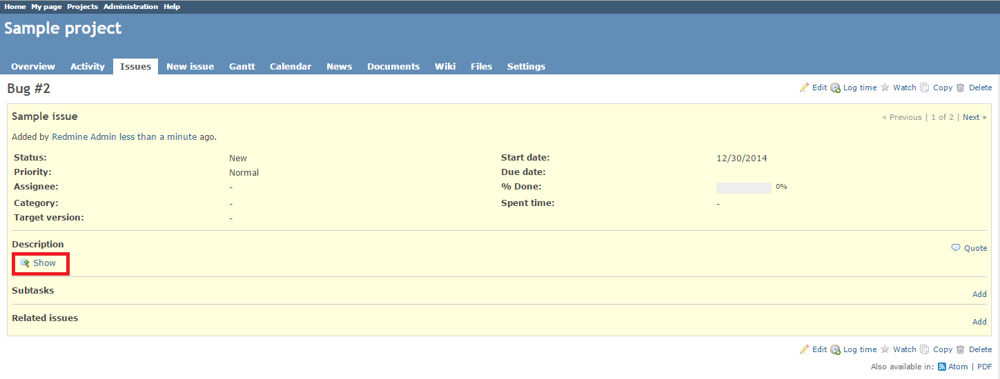
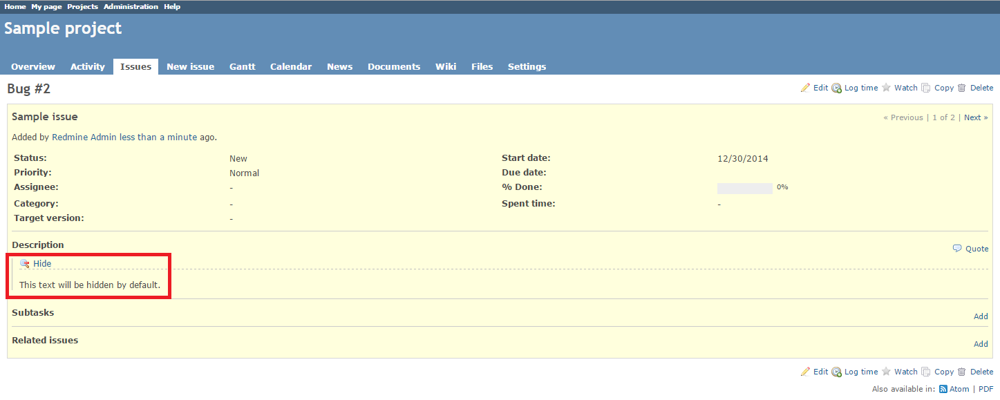
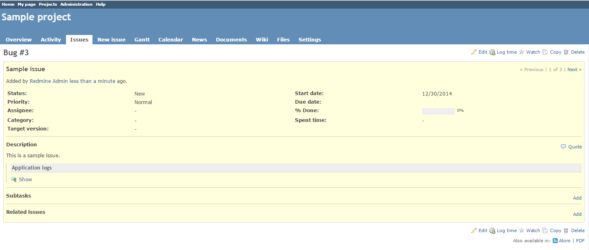
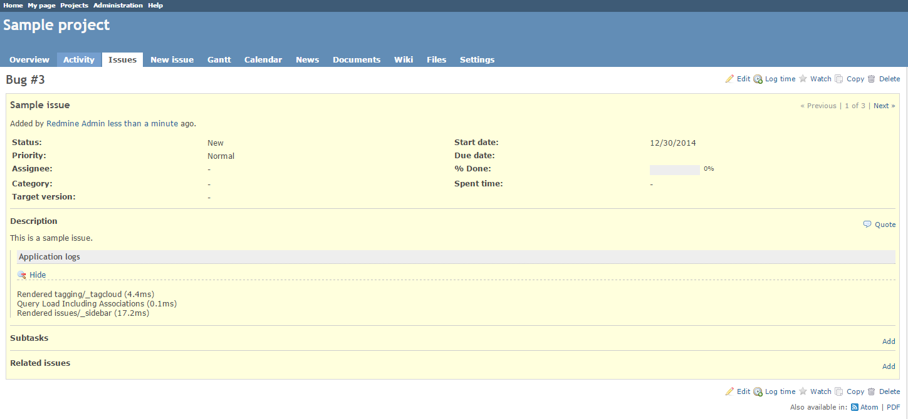

# Redmine Cut Tag Plugin

This plugin enables you to use the **cut** macro to hide text in Redmine.

## Installation

This plugin version is compatible only with Redmine 2.x and later.

1. To install the plugin
    * Download the .ZIP archive, extract files and copy the plugin directory into *#{REDMINE_ROOT}/plugins*.
    
    Or

    * Change you current directory to your Redmine root directory:  

            cd {REDMINE_ROOT}
 
      Copy the plugin from GitHub using the following command:

            git clone https://github.com/Undev/redmine_cut_tag.git plugins/redmine_cut_tag

2. Update the Gemfile.lock file by running the following commands:  

         rm Gemfile.lock  
         bundle install

3. Restart Redmine.

Now you should be able to see the plugin in **Administration > Plugins**.

## Usage

The plugin enables you to hide text behind a link in Redmine project descriptions, issue descriptions and notes, Wiki, etc.

To hide the text, use the **``{{cut_start}}``** and **``{{cut_end}}``** tags.

For example:

    {{cut_start}}
    This text will be hidden by default.
    {{cut_end}}

The text wrapped by the tags is hidden by default. To read the text, click the **Show** link. 

To hide the text again, click the **Hide** link.  

You can also add an optional title before the hidden text under using the **``{{cut_start(title)}}``** and **``{{cut_end}}``** tags.

For example:

    {{cut_start(Application logs)}}
    Rendered tagging/_tagcloud (4.4ms)
    Query Load Including Associations (0.1ms)
    Rendered issues/_sidebar (17.2ms)
    {{cut_end}}

  
  

## License

Copyright (c) 2014 Undev

Licensed under the Apache License, Version 2.0 (the "License");
you may not use this file except in compliance with the License.
You may obtain a copy of the License at

http://www.apache.org/licenses/LICENSE-2.0

Unless required by applicable law or agreed to in writing, software
distributed under the License is distributed on an "AS IS" BASIS,
WITHOUT WARRANTIES OR CONDITIONS OF ANY KIND, either express or implied.
See the License for the specific language governing permissions and
limitations under the License.
